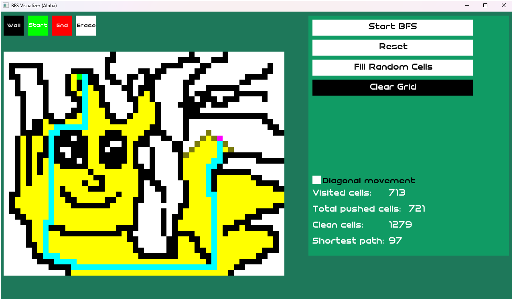
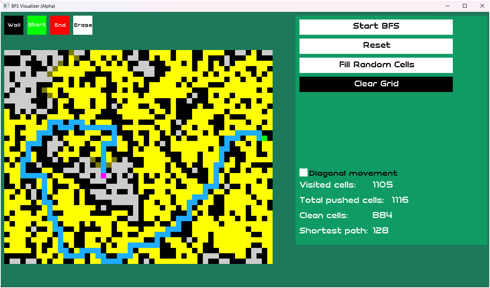
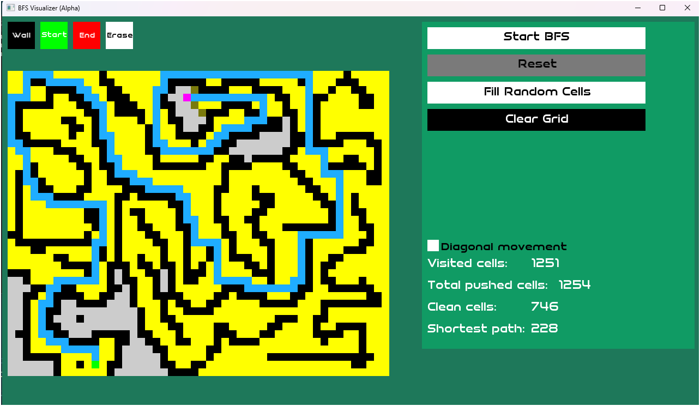
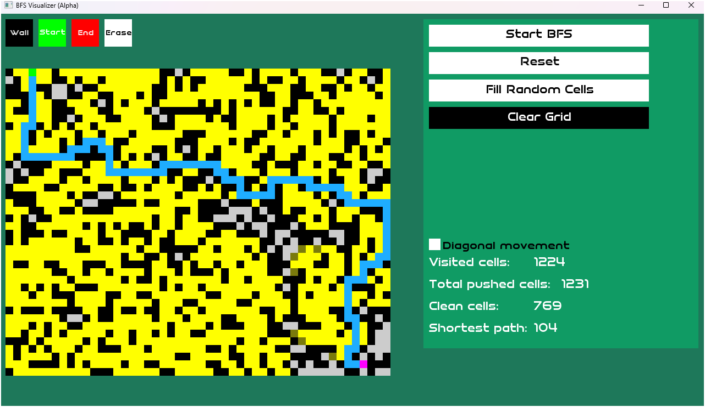
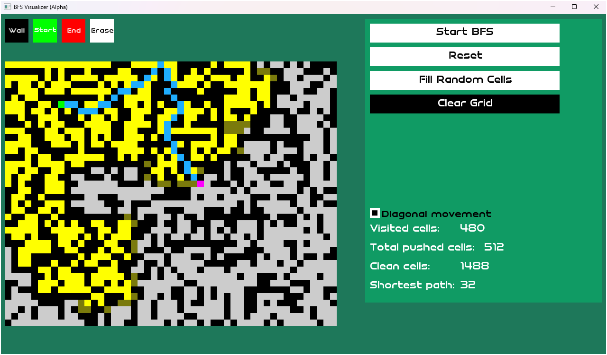

# BFS Shortest Bath Visualizer (Alpha version)
*`this is the first version of the algorithm visualizer 
im making using C++ and SFML graphics library.`*

**Fast access**:
1. [Some initial images inside project](#some-initial-screenshots)
1. [Bugs](#bugs-faced-along-the-developement-process)
1. [Developement steps](#steps-plannedmade-during-the-developement)
1. [Road map](#road-map-to-the-complete-algorithm-visualizer-project)

---
## Programming languages/libraries used :
> - C++.
> - SFML graphics library.

## programming concepts/techniques used and applied :
> - (OOP) Object oriented programming concepts.
> - Separating interface from implementation.
> - BFS shortest bath algorithm.
> - Data Structures:
>> - Basic array
>>	- Vector
>>	- Queue
> - simple Backtracking.
> - Pointers.
> - Basic Math.
> - Problem solving.
	

## Bugs Faced along the developement process :
> - [x] Program crashes as vector out of bounds (random times). 
> - [x] Program crashes when clicking any of the buttons on the direct opening.

## Steps planned/made during the developement :
> - [x] Adding label class.
> - [x] Add text UI : to show number of cells scanned, shortest path cells count, clean cells. 
> - [x] Add Button class.
> - [x] Mouse cursor on button havoring/clicking.
> - [x] Generating random maze on the grid.	
> - [x] Button class auto resize text.
> - [x] Button class center text aligning.
> - [x] transform color boxes to buttons (optimization)
> - [x] Add checkbox class.
> - [x] Add checkbox for diagonal moving.
> - [ ] complete all text alignment	functions in the Button class.

---

## Road map to the complete Algorithm visualizer project
> ## *Phase I (BFS Algorithm)*
>> - [x] BFS implementation and visualizing.
>> - [x] Implementation of UIME.h file for UI components like buttons, textBoxes, ect..
>> - [x] Phase I debugging and fixing.
>> - [ ] Optimizations for phase I.
> ## *Phase II (Dijkstra Algorithm)*
>> - [ ] BFS implementation and visualizing.
>> - [ ] Optimizations for phase II.

---
## Some initial screenShots :
---

